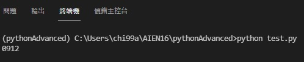
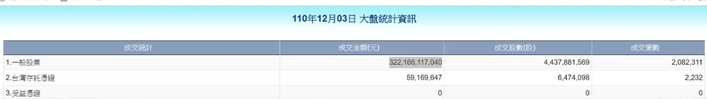
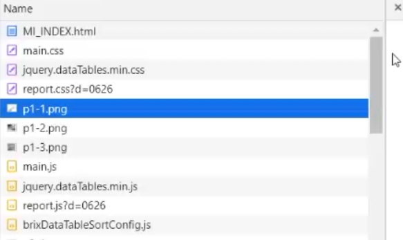
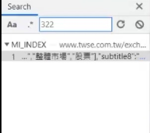

## Request methods
- GET   : 瀏覽器網址列
- POST  : 輸入帳密，登入
- PUT   : 上傳檔案
- PATCH : 更新資料
- DELETE : 刪除資料
## Regex
- Start with : **^**
  - Ex : ^09
- End with : **$**
  - Ex : \d{8}$
- Number : **\d** (d : digit)
- Character : **\w** (w : word)
- Invisible Character : **\s**
  - Ex : Tab, Enter 
- Count : **{ }**
  - Ex : {8}
- Count Range : **{\<N1>, \<N2>}**
  - Ex : \d{1, 3} -> 會出現1~3個數字
- One or More : **\+**
- Zero or More : **\***
- ero or One : **?**
- Any word : **.**
- Escape word : **\\**
- Name Group : **?P\<name><br>**
  ```
  import re

  m = re.match(r'(?P<provider>^09\d\d)\d{6}$', '0912345678')
  print(m.group('provider'))
  ```
  
- Replace : re.sub(\<**Pattern**>, \<**Replacement**>, \<**Source**>)
## Chrome Developer tool usage
- Things to Notice
  - \[&#10003;] **Perserve log**
    - 以防被轉頁而看不到log
  - **referer** tag
  - **user-agent** tag
- 證交所資料查詢<br>
    
  - 點選任意Name欄裡的資料<br>
    
  - 按下Ctrl+F，跑出Search搜尋欄後，打入關鍵字<br>
    
## Response content
- resp.**content** : Binary content
- resp.**text** : Text content
- resp.**json()** : JSON

## href
- 當前網址: https://tw.apple.com/a/b
- href="/a/b/c" : 從**根**目錄開始
  - direct to : https://tw.apple.com/a/b/c
- href="a/b/c" : 從**當前**目錄開始
  - direct to : https://tw.apple.com/a/a/b/c